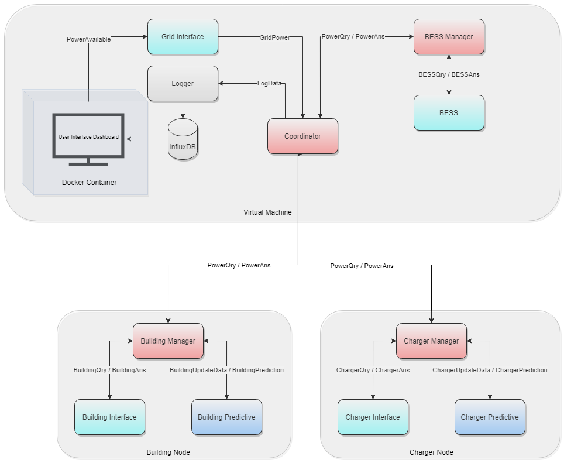

# app.remapp

RIAPS Energy Management App

## Architecture

The overall application architecture can be seen in the following figure:

## Messages and Message formats

The various message types and their expected formats are listed here. They are also documented as comments within the source code files.

- Manager to Device Component : list of strings denoting the quantities to be queried.
    - ChargerQry : Quantities can be in {'all', 'energyConsumed' , 'peakPower' , 'rollingPowerAvg'}. For eg. `['all']`.
        - energyConsumed : Total energy consumed by the charger in the time duration in kWh.
        - peakPower : Maximum real power consumed in the time duration in kW.
        - rollingPowerAvg : Average power consumed in the time duration in kW.
    
    - BuildingQry : Quantities can be in {'all', 'TotalPower', 'HVAC', 'Temp', 'Lighting'}. For eg. `['TotalPower', 'HVAC', 'Temp']`. Details about the quantities can be found in `excel_config.yaml` in the `config` directory.
        - TotalPower : Total power consumed by each building unit in kW. The response is coded as "BuildingUnit\_TotalPower". For e.g. "HT\_TotalPower" for HillTop unit. 
        - HVAC : Total power consumed by the HVAC in each subunit of each building unit in kW. The response is coded as "BuildingUnit\_Subunit\_HVAC\_Power". For e.g. "HT\_HTG\_M10:RTU3\_HVACPower" for HillTop G subunit within HillTop unit.
        - Temp : Outside air temperature and average inside temperature data of building units in F. For e.g. "OutsideAirTemp", "HT\_HTE\_AvgTemp1" for Hilltop E average temperature.
        - Lighting : Total power consumed by the Lighting in each subunit of each building unit in kW. The response is coded as "BuildingUnit\_Subunit\_LightingPower". For e.g. "HT\_HTG\_2L2:M2:2L2\_LightingPower" for HillTop G subunit within HillTop unit.
    
    - BESSQry : Quantities can be in {'Rbess','Cbattery','SoCl','SoCu','SoCend','SoC'}. For eg.`['Rbess','Cbattery','SoCl','SoCu','SoCend','SoC']`. Details about the quantities and valuesused can be found in `remapp.depl`.
        - Rbess : The power rating of the BESS in kW.
        - Cbattery : The battery capacity in kW.
        - SoCl : The lower bound of State-of-Charge.
        - SoCu : The upper bound of State-of-Charge.
        - SoCend : The end State-of-Charge.
    
- Device Component to Manager : list of dictionaries containing {qty : value} pairs and a datetime. 

    - ChargerAns 
    - BuildingAns 
    - BESSAns 
    
- Manager to Predictive : dictionary {'Date': str, 'aggregatedPower' : float}

    - ChargerUpdateData 
    - BuildingUpdateData 
    
- Predictive to Manager : list of predicted power values for future time steps. 

    - ChargerPrediction 
    - BuildingPrediction 
    
- Manager to Coordinator : power query to the Coordinator component.

    - PowerQry : tuple (reqID,reqKind,reqTime,reqPower,currPower), where    
        reqID : ID of the individual unit requesting power   
        reqKind : type of load {'BU' - Builings, 'EV' - EV Chargers, 'BESS" - Battery Units}   
        reqTime : the current time step   
        reqPower : the predicted power consumption for some future time horizon   
        or  
        {qty: value} (for BESS) : dictionary of attributes specific to the battery   
         currPower : the power consumption at the current time step
         
- Coordinator to Manager :   dispatched power from Coordinator 

    - PowerAns : tuple (type, powerGranted) , where  
                 type : type of load {'BU' - Builings, 'EV' - EV Chargers, 'BESS" - Battery Units}    
                 powerGranted : list of power values for the time horizon.
                 
- Coordinator to Logger : datastream to log in to influxdb.   
    - LogData : a list of tuples.
            Each tuple is of the format (tags, measurement, timestamps, values), where    
            tags : dictionary containing the tag column names and their values     
            measurement : name of the measurement (table in InfluxDB) where the values will be stored    
            timestamps : list of timestamps corresponding to each value    
            values: list of dictionaries where each dictionary is {column_name : value}     

## Data Logging

InfluxDB is used as the data repository for the application. In total there are 5 database tables used to store time-series data. The table names, column names are specified in `influxdb_config.yaml` in the `config` directory.

1. Power consumption at the current timestep

|   Actual Power  |
|-----------------|
| time (timestamp)|
| type (string)   |
| ID (string)     |
| power (float)   | 

2. Predicted power consumption for a future time horizon

| Predicted Power |
|-----------------|
| time (timestamp)|
| type (string)   |
| ID (string)     |
| power (float)   |  

3. Power to be dispatched as calculated by the coordinator for the entire time horizon

| Dispatched Power|
|-----------------|
| time (timestamp)|
| type (string)   |
| ID (string)     |
| power (float)   |  

4. Total power available from the grid for the entire time horizon

| Available Power |
|-----------------|
| time (timestamp)|
| power (float)   |  

5. Battery State-of-Charge

|   Battery SoC    |
|------------------|
| time (timestamp) |
| ID (string)      |
| SoC (float)      |   

=======
